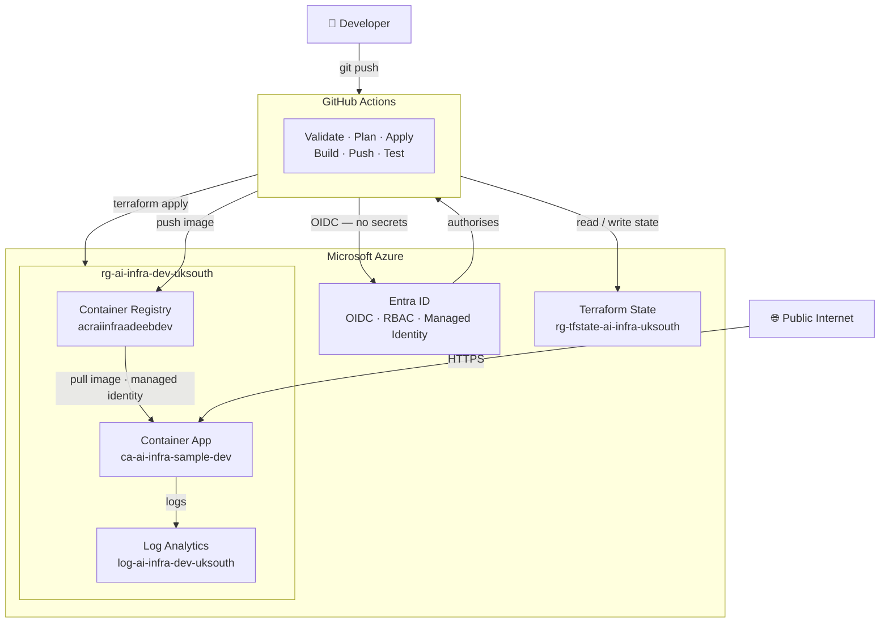

# Azure Cloud-Native Infrastructure Platform

A cloud-native infrastructure platform on Microsoft Azure, provisioned with Terraform, deployed via GitHub Actions, and designed to reflect how cloud infrastructure and platform engineering teams approach IaC, identity, CI/CD, and operational documentation.

---


---

## Overview

This platform provisions, hosts, and operates a containerised workload on Azure using infrastructure as code, identity-based authentication, and automated CI/CD pipelines. It was built to simulate the responsibilities of a cloud infrastructure or platform engineering team — not to build an application, but to build and operate the infrastructure that runs one.

The platform covers the full infrastructure lifecycle: resource provisioning via Terraform, container image publishing via GitHub Actions, workload hosting via Azure Container Apps, and centralised logging via Log Analytics. Every component and design decision is documented, including what has been deliberately deferred and why.

This is a portfolio project in active development. Level 1 and Level 1.1 are complete. Level 2 will extend the platform with metrics, dashboards, and alerting.

---

## Architecture

The platform is structured in four layers: a CI/CD layer (GitHub Actions), an identity layer
(Microsoft Entra ID), an Azure infrastructure layer (the running resources), and a separate
control-plane layer (Terraform remote state). Each layer has a single responsibility and is
independently auditable.



A developer pushes to GitHub, which triggers the CI/CD pipelines. All workflows authenticate
to Azure using OIDC — no client secrets or stored credentials exist anywhere in the platform.
Terraform provisions the infrastructure; Docker builds and pushes the container image to the
registry. The Container App pulls that image using a managed identity rather than registry
credentials, and forwards its logs to Log Analytics.

For the full architecture including resource names, identity model, data flows, design
decisions, and known limitations, see [`docs/architecture.md`](docs/architecture.md).

---

## Platform components

| Component | Azure resource name | Purpose | Notes |
|---|---|---|---|
| Resource group (app) | `rg-ai-infra-dev-uksouth` | Contains all application infrastructure | Managed by Terraform |
| Resource group (state) | `rg-tfstate-ai-infra-uksouth` | Contains Terraform remote state backend | Separate from app resources; intentional isolation |
| Container Registry | `acraiinfraadeebdev` | Private image registry for container workloads | Basic SKU · admin disabled · AcrPull via managed identity only |
| Container Apps Environment | `cae-ai-infra-dev-uksouth` | Managed runtime boundary for Container Apps | Wired to Log Analytics on creation |
| Container App | `ca-ai-infra-sample-dev` | Hosts the containerised workload | 0.25 vCPU · 0.5 GiB · public ingress · port 8080 |
| Log Analytics Workspace | `log-ai-infra-dev-uksouth` | Centralised log collection | PerGB2018 SKU · 30-day retention |
| User-assigned managed identity | `id-ai-infra-containerapp-dev` | Assigned to Container App for credential-free ACR access | AcrPull scoped to registry only |
| Storage account (state) | `sttfstateaiinfraadeeb` | Stores Terraform state file | AAD auth · `use_azuread_auth = true` |
| Blob container | `tfstate` | Holds state blob | Key: `dev.terraform.tfstate` |

---

## Identity and access model

Authentication across this platform is handled entirely through Azure's identity systems. There are no static passwords, no client secrets, and no registry admin credentials anywhere in the platform.

### GitHub Actions → Azure (OIDC federation)

GitHub Actions authenticates to Azure using OpenID Connect rather than a stored client secret. When a workflow runs, GitHub generates a short-lived OIDC token scoped to the repository. That token is exchanged with Microsoft Entra ID, which validates the federated credential configuration and returns a short-lived Azure access token. The token is valid only for the duration of the workflow run.

This matters because client secrets are long-lived credentials that must be rotated, can be leaked via logs or environment variable exposure, and are difficult to scope precisely. The OIDC model eliminates the credential entirely — there is nothing to leak and nothing to rotate.

Three values are stored as GitHub Actions secrets: `AZURE_CLIENT_ID`, `AZURE_TENANT_ID`, and `AZURE_SUBSCRIPTION_ID`. None of these are secrets in the security sense — they are identifiers. The trust relationship is enforced by the federated credential configuration in Entra ID, not by the secrecy of these values.

The GitHub OIDC principal holds two RBAC assignments:

- **Contributor + Storage roles** scoped to the subscription, allowing Terraform to manage resources and read/write the remote state backend.
- **AcrPush** scoped specifically to `acraiinfraadeebdev`, allowing the Docker build workflow to publish images. This scope is deliberate — the CI principal has no broader registry permissions.

### Container App → ACR (managed identity)

The Container App is assigned a user-assigned managed identity (`id-ai-infra-containerapp-dev`). This identity holds an **AcrPull** role assignment scoped to the registry. When the Container App pulls an image at startup or revision change, it authenticates using this identity — no username, no password, no stored credential.

Admin access on the registry (`admin_enabled = false`) is disabled. The only way to pull images from `acraiinfraadeebdev` is via a principal that holds the AcrPull role. This prevents credential-based access entirely, even if someone were to attempt it.

---

## CI/CD pipeline

All five workflows authenticate to Azure using the OIDC federation described above.

### terraform-validate

**Trigger:** push to any branch, pull request.

Runs `terraform fmt -check`, `terraform init`, and `terraform validate` in sequence. This checks formatting compliance, initialises the backend to confirm state access is working, and validates that the configuration is syntactically and semantically correct. It does not run a plan and makes no changes to infrastructure or state.

### terraform-plan

**Trigger:** pull request to `main` when Terraform files change, and manual (`workflow_dispatch`).

Initialises Terraform and runs `terraform plan` against the remote state. The output shows what would change if apply were run. The expected healthy output for an unchanged platform is `No changes. Your infrastructure matches the configuration.` This workflow makes no changes to infrastructure or state.

### terraform-apply

**Trigger:** manual (`workflow_dispatch`).

Runs `terraform apply` to deploy or update infrastructure. This workflow is manually triggered rather than automatically executed on merge. The reason is operational: infrastructure changes carry higher risk than application changes, and a human review step before apply is a deliberate control. This is not a workaround for missing automation — it is the intended model for Level 1.

### docker-build

**Trigger:** push to `main`.

Logs in to Azure via OIDC, authenticates to ACR, builds the Docker image from `app/Dockerfile`, and pushes two tags to `acraiinfraadeebdev`: `latest` and the full git commit SHA (e.g. `acraiinfraadeebdev.azurecr.io/azure-ai-infra-platform:abc1234`). The git SHA tag makes every pushed image traceable to a specific commit.

**Known limitation:** this workflow does not trigger a new Container App revision after pushing the image. A new image in ACR does not automatically roll out to the running workload. Updating the Container App to run a new image revision remains a manual step. Automated rollout is deferred to a future level.

### azure-login-test

**Trigger:** manual, or on push to `main`.

Runs `az login` using OIDC and confirms the authentication flow succeeds end to end. Used to validate the federated credential configuration after any changes to the Entra ID setup.

---

## Terraform

### Version and provider constraints

```hcl
terraform {
  required_version = ">= 1.6.0, < 2.0.0"

  required_providers {
    azurerm = {
      source  = "hashicorp/azurerm"
      version = "~> 3.100"
    }
  }
}
```

The upper bound `< 2.0.0` prevents a future major version of Terraform from running this configuration without an explicit upgrade decision. The `~> 3.100` constraint on the provider allows patch-level updates within 3.x but prevents a 4.x provider from being silently adopted. Both constraints protect against silent breaking changes in automated pipelines.

### Remote state backend

```hcl
backend "azurerm" {
  resource_group_name  = "rg-tfstate-ai-infra-uksouth"
  storage_account_name = "sttfstateaiinfraadeeb"
  container_name       = "tfstate"
  key                  = "dev.terraform.tfstate"
  use_azuread_auth     = true
}
```

State is stored remotely in a dedicated resource group (`rg-tfstate-ai-infra-uksouth`) that is separate from the application resource group. The separation means that destroying or recreating application infrastructure does not affect the state backend, and the state backend can have its own access controls and lifecycle independent of the workload.

`use_azuread_auth = true` instructs the backend to authenticate using the caller's Azure AD identity rather than a storage account key. This means the GitHub OIDC principal needs explicit data-plane permissions on the storage account — a distinction between management-plane (Contributor) and data-plane (Storage Blob Data Contributor) permissions that is non-obvious and was a real troubleshooting exercise during setup.

### DRY tagging with locals

```hcl
locals {
  common_tags = {
    project     = "azure-ai-infra-platform"
    environment = var.environment
    managed_by  = "terraform"
  }
}
```

All resources use `tags = local.common_tags` rather than inline tag blocks. This ensures consistency, avoids drift between resources, and makes the `environment` value a single variable rather than a hardcoded string repeated across every resource definition.

### Environment variable and tfvars

The `environment` variable is declared in `variables.tf` and currently defaults to `dev`. The variable was introduced to avoid hardcoded environment values throughout the configuration and to support future environment expansion without restructuring the codebase.

A `terraform.tfvars.example` file documents the expected values without committing real configuration to the repository. This file is the safe onboarding path — anyone cloning the repository copies the example file, fills in their values, and has a working configuration without needing to read the variable definitions.

---

## Observability

Centralised logging is implemented. Metrics, alerting, and dashboards are not.

The Container Apps Environment is configured to send platform and container logs to `log-ai-infra-dev-uksouth`. Container stdout/stderr is captured as `ContainerAppConsoleLogs_CL`. Platform-level events (scaling, revision changes, environment health) are captured as `ContainerAppSystemLogs_CL`. Both are queryable via KQL in the Azure portal.

Example queries:

```kusto
ContainerAppConsoleLogs_CL
| take 20
```

```kusto
ContainerAppSystemLogs_CL
| take 20
```

The following are not yet implemented and are explicitly out of scope for Level 1:

- Metrics collection
- Azure Monitor alert rules
- Dashboards or workbooks
- Application Insights
- Distributed tracing
- SLOs
- Incident management workflows
- OpenTelemetry instrumentation

These belong to Level 2. The current state is: logs exist and are queryable. Calling this an observability platform would be inaccurate.

---

## Design decisions

| Decision | Chosen | Not chosen | Reason |
|---|---|---|---|
| Container runtime | Azure Container Apps | AKS | Level 1 focuses on IaC, identity, and CI/CD — not Kubernetes cluster operations. Container Apps removes the node pool, control plane, and cluster upgrade concerns that would dominate Level 1 scope. |
| CI/CD authentication | GitHub OIDC | Client secret stored in GitHub secrets | Client secrets are long-lived, require rotation, and can be leaked. OIDC tokens are short-lived, scoped to the workflow run, and require no secret storage. |
| ACR access (Container App) | User-assigned managed identity with AcrPull | Registry admin credentials | Admin credentials are a username and password stored somewhere. A managed identity has no password, cannot be leaked, and is automatically managed by Azure. |
| Terraform state | Azure Blob Storage (remote, AAD auth) | Local state file | Local state cannot be shared with CI/CD pipelines and is lost if the local machine is lost. Remote state with AAD auth avoids storage key management and is compatible with the OIDC authentication model used by GitHub Actions. |
| Terraform apply trigger | Manual (`workflow_dispatch`) | Automatic on merge to main | Infrastructure changes are higher risk than application changes. A human trigger before apply is an explicit control, not a gap. Automatic apply is appropriate when plan review is enforced via PR gates — that pattern is planned but not yet implemented. |
| Network | Public ingress, no VNet | VNet integration, private endpoints, NSGs | The current workload is public, stateless, and has no private dependencies. VNet integration adds operational overhead without solving a problem that exists at this stage. It is deferred, not excluded. |

---

## Known limitations

The following are accepted limitations for Level 1. They are documented tradeoffs against the current workload requirements and project scope — not gaps that were missed.

- Public ingress with no network-level access controls
- No VNet integration
- No private endpoints for ACR or other services
- No private DNS zones
- No Azure Key Vault
- No secret rotation
- No container image vulnerability scanning
- No Microsoft Defender for Containers
- No Terraform drift detection
- No `checkov` or `tfsec` in the CI pipeline
- No `tflint` in the CI pipeline
- No `terraform plan` output posted as PR comments
- No Azure Monitor alert rules
- No dashboards or workbooks
- No metrics collection
- No distributed tracing
- No automatic Container App revision rollout after image push
- No environment promotion (dev → staging → prod)

---

## Repository structure

```text
.
├── app/
│   ├── app.py              # Flask application with / and /health endpoints
│   ├── Dockerfile          # Container image definition
│   ├── requirements.txt    # Python dependencies
│   └── .dockerignore       # Files excluded from the Docker build context
│
├── infra/
│   └── terraform/
│       ├── main.tf                  # All resource definitions, backend, provider, locals
│       ├── variables.tf             # Input variable declarations with descriptions
│       ├── outputs.tf               # Output values (resource names, URLs, IDs)
│       └── terraform.tfvars.example # Template for local variable values — copy and fill in
│
├── docs/
│   ├── architecture.md     # Architecture description and Mermaid diagram
│   └── runbook.md          # Operational procedures for common tasks and incidents
│
├── screenshots/
│   ├── 01-architecture.png          # Architecture diagram
│   ├── 02-resource-group.png        # Azure portal — resource group contents
│   ├── 03-container-app.png         # Azure portal — Container App overview
│   ├── 04-acr-cli.png               # ACR image list via CLI
│   ├── 05-terraform-plan.png        # terraform plan output (no changes)
│   ├── 06-terraform-apply.png       # terraform apply output
│   ├── 07-azure-login-oidc.png      # GitHub Actions OIDC login success
│   ├── 08-log-analytics-kql.png     # KQL query results in Log Analytics
│   ├── 09-health-endpoint.png       # /health endpoint response
│   └── 10-remote-terraform-state.png # Remote state blob in Azure portal
│
└── .github/
    └── workflows/
        ├── terraform-validate.yml  # Runs fmt, init, validate on every push and PR
        ├── terraform-plan.yml      # Runs plan on pull requests
        ├── terraform-apply.yml     # Manually triggered apply
        ├── docker-build.yml        # Builds and pushes image to ACR on push to main
        └── azure-login-test.yml    # Validates OIDC authentication end to end
```

---

## Getting started

### Prerequisites

- An Azure subscription with permissions to create resource groups, assign roles, and register an app registration
- Terraform >= 1.6.0, < 2.0.0
- Docker (for local builds)
- Azure CLI (`az`)
- GitHub repository with Actions enabled and OIDC federated credential configured against your Entra ID app registration

### 1. Clone the repository

```bash
git clone https://github.com/adeeb-cybersecurity/azure-ai-infra-platform.git
cd azure-ai-infra-platform
```

### 2. Configure Terraform variables

```bash
cp infra/terraform/terraform.tfvars.example infra/terraform/terraform.tfvars
```

Edit `terraform.tfvars` with your resource names, location, and environment value. This file is gitignored and will not be committed.

### 3. Create the Terraform state backend

The backend storage account and blob container must exist before Terraform can initialise. Create them manually or via the Azure CLI before running `terraform init`:

```bash
az group create --name rg-tfstate-ai-infra-uksouth --location uksouth
az storage account create --name sttfstateaiinfraadeeb --resource-group rg-tfstate-ai-infra-uksouth --sku Standard_LRS
az storage container create --name tfstate --account-name sttfstateaiinfraadeeb
```

### 4. Initialise and apply Terraform

```bash
cd infra/terraform
terraform init
terraform plan
terraform apply
```

Review the plan output before confirming apply. The expected result is the creation of the resources listed in the platform components table above.

### 5. Push an image via GitHub Actions

Push a commit to `main`. The `docker-build.yml` workflow will authenticate to Azure via OIDC, build the image, and push it to ACR tagged with `latest` and the git commit SHA.

Note: pushing a new image does not automatically update the running Container App revision. That step is currently manual.

### 6. RBAC requirements for the GitHub OIDC principal

The Entra ID principal used by GitHub Actions requires the following role assignments:

- `Contributor` on the subscription (for Terraform resource management)
- `Storage Blob Data Contributor` on the state storage account (for `use_azuread_auth = true`)
- `AcrPush` on `acraiinfraadeebdev` (for image publishing)

---

## Level 2 roadmap

Level 2 will extend the platform with observability and platform operations capabilities. The current state — logs exist and are queryable — is a foundation, not a complete observability implementation.

The target areas for Level 2 are metrics collection, dashboards, alerting, runbooks tied to alert conditions, and operational visibility into the running workload. Technologies under consideration include Azure Monitor, Azure Managed Grafana, Application Insights, and OpenTelemetry. Each will be adopted only if it solves a specific operational problem — the goal is not to add tools but to answer the question: *how do we know the platform is healthy, and what do we do when it isn't?*

Level 2 will not introduce Kubernetes, a service mesh, or significant application changes. The infrastructure layer established in Level 1 remains the foundation.

---

## Docs

- [`docs/architecture.md`](docs/architecture.md) — architecture description and diagram
- [`docs/runbook.md`](docs/runbook.md) — operational procedures
