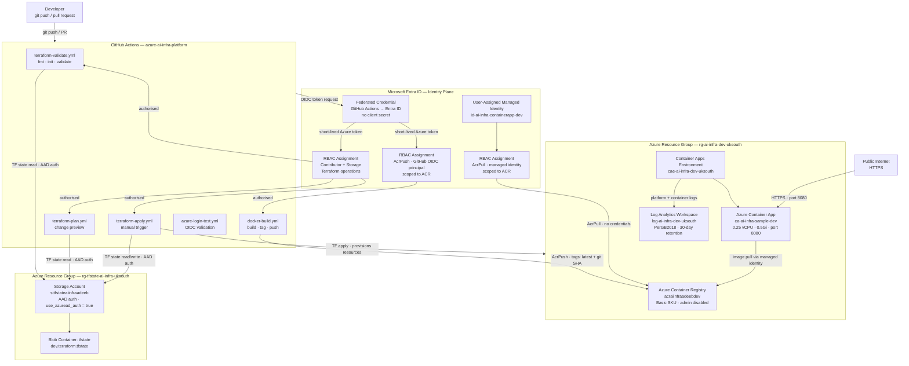

# Architecture

## Overview

This document describes the architecture of the Azure Cloud-Native Infrastructure Platform
as of Level 1. It covers the four-layer structure, resource inventory, identity and access
model, data flows, and design decisions. Known limitations are listed at the end.

For a high-level summary see the [README](../README.md).

---

## Diagram

The diagram is organised into four layers: CI/CD (GitHub Actions), identity
(Microsoft Entra ID), application infrastructure (the running Azure resources), and
Terraform state backend (a separate control-plane resource group). Keeping these as
distinct layers means each can be changed, audited, or broken independently without
affecting the others.

---

## Resource inventory

| Resource | Name | Resource group | Notes |
|---|---|---|---|
| Container Registry | `acraiinfraadeebdev` | `rg-ai-infra-dev-uksouth` | Basic SKU · admin disabled · AcrPull via managed identity only |
| Container Apps Environment | `cae-ai-infra-dev-uksouth` | `rg-ai-infra-dev-uksouth` | Wired to Log Analytics on creation |
| Container App | `ca-ai-infra-sample-dev` | `rg-ai-infra-dev-uksouth` | 0.25 vCPU · 0.5Gi · public ingress · port 8080 |
| Log Analytics Workspace | `log-ai-infra-dev-uksouth` | `rg-ai-infra-dev-uksouth` | PerGB2018 · 30-day retention |
| User-assigned managed identity | `id-ai-infra-containerapp-dev` | `rg-ai-infra-dev-uksouth` | AcrPull scoped to registry only |
| Storage account (state) | `sttfstateaiinfraadeeb` | `rg-tfstate-ai-infra-uksouth` | `use_azuread_auth = true` · no storage key access |
| Blob container | `tfstate` | `rg-tfstate-ai-infra-uksouth` | Key: `dev.terraform.tfstate` |

---

## Identity and access model

There are no static passwords, client secrets, or registry admin credentials in this
platform. All authentication is handled through Azure's identity systems.

### GitHub Actions → Azure

Workflows authenticate using OpenID Connect. GitHub generates a short-lived token scoped
to the repository; that token is exchanged with Entra ID for a short-lived Azure access
token valid only for the duration of the workflow run. The three values stored as GitHub
secrets (`AZURE_CLIENT_ID`, `AZURE_TENANT_ID`, `AZURE_SUBSCRIPTION_ID`) are identifiers,
not credentials — the trust is enforced by the federated credential configuration in
Entra ID.

The GitHub OIDC principal holds two RBAC assignments:

- `Contributor` + `Storage Blob Data Contributor` — scoped to allow Terraform to manage
  resources and authenticate to the state backend without a storage key
- `AcrPush` — scoped specifically to `acraiinfraadeebdev`, allowing image publishing
  only, with no broader registry permissions

### Container App → ACR

The Container App is assigned `id-ai-infra-containerapp-dev`, a user-assigned managed
identity with `AcrPull` scoped to `acraiinfraadeebdev`. Image pulls at runtime use this
identity — no username, no password, no stored credential. Registry admin access is
disabled (`admin_enabled = false`), making credential-based access impossible.

---

## Data flows

**Deployment flow**
Developer pushes to GitHub → GitHub Actions triggers → OIDC exchange with Entra ID →
Terraform reads/writes remote state → `terraform apply` provisions or updates Azure
resources.

**Image flow**
Push to `main` → `docker-build.yml` triggers → OIDC login → ACR login → image built and
pushed with `latest` and git SHA tags → image available in `acraiinfraadeebdev`.

**Runtime flow**
Container App starts or revision changes → pulls image from ACR via managed identity →
serves traffic on port 8080 → forwards stdout/stderr and platform events to Log Analytics.

**Request flow**
Public internet → HTTPS → Container App ingress → port 8080 → application.

---

## Design decisions

| Decision | Chosen | Not chosen | Reason |
|---|---|---|---|
| Container runtime | Azure Container Apps | AKS | Level 1 scope is IaC, identity, and CI/CD — not Kubernetes cluster operations. Container Apps removes node pool and control plane management. |
| CI/CD authentication | GitHub OIDC | Client secret | Client secrets are long-lived and must be rotated. OIDC tokens are short-lived and scoped to the workflow run. |
| ACR access | User-assigned managed identity + AcrPull | Registry admin credentials | Admin credentials are a stored password. Managed identity has no password and is scoped to the minimum required permission. |
| Terraform state | Remote blob storage + AAD auth | Local state | Local state cannot be shared with CI/CD and is lost if the local machine is lost. AAD auth avoids storage key management. |
| Terraform apply | Manual trigger | Auto-apply on merge | Infrastructure changes carry higher risk than application changes. A manual trigger is an explicit human review gate. |
| Network | Public ingress, no VNet | VNet + private endpoints + NSGs | The workload is public and stateless with no private dependencies. VNet integration adds operational overhead without solving a current problem. Deferred. |

---

## Known limitations

These are accepted scope boundaries for Level 1, not oversights.

- Public ingress with no network-level access controls
- No VNet integration, private endpoints, or private DNS
- No Azure Key Vault or secret rotation
- No container image vulnerability scanning
- No Microsoft Defender for Containers
- No Terraform drift detection
- No `checkov`, `tfsec`, or `tflint` in CI
- No `terraform plan` output posted as PR comments
- No Azure Monitor alert rules, dashboards, or metrics
- No distributed tracing or Application Insights
- No automatic Container App revision rollout after image push
- No environment promotion (dev → staging → prod)

Level 2 will address observability. Network segmentation and Key Vault are planned for
a future level.