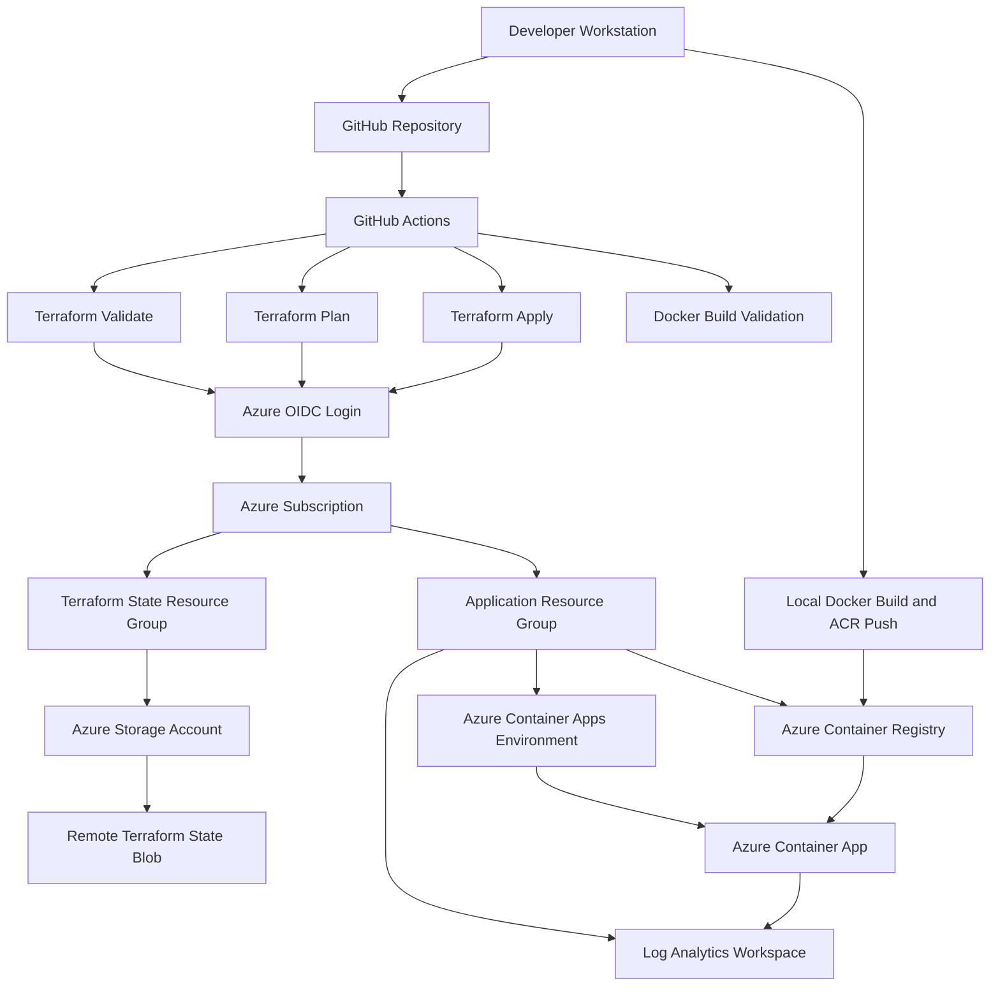

# Architecture

## Level 1: Azure Cloud-Native Infrastructure Platform

This diagram shows the Level 1 platform architecture. The goal of Level 1 is to provision and deploy a containerized workload on Azure using Terraform, Docker, GitHub Actions, remote Terraform state, and secure OIDC authentication.

## Project Roadmap

This repository is structured as a multi-level platform engineering project.

Level 1 focuses on cloud-native infrastructure foundations, including Infrastructure as Code, secure CI/CD, containerized workloads, remote Terraform state, and Azure platform services.

Level 2 extends the platform with production-style observability capabilities, including metrics, dashboards, alerting, and operational monitoring.

Level 3 extends the platform into AI infrastructure by introducing managed identities, secret management, AI service integration patterns, AI gateway architecture, and AI workload governance.

The current architecture document describes the completed Level 1 platform foundation.

## Components

### GitHub Repository

The GitHub repository is the source of truth for the platform.

It stores:

- Terraform infrastructure code
- Application source code
- Docker configuration
- GitHub Actions workflows
- Documentation

Infrastructure changes are tracked through Git history and executed through GitHub Actions.

### GitHub Actions

GitHub Actions provides the CI/CD automation layer.

Current workflows include:

- Terraform Validate
- Terraform Plan
- Terraform Apply
- Docker Build Validation
- Azure Login Test

Terraform Apply is manual-only to reduce the risk of unintended infrastructure changes.

### Azure OIDC Authentication

GitHub Actions authenticates to Azure using OpenID Connect.

This avoids storing long-lived Azure client secrets in GitHub.

The GitHub workflow receives short-lived credentials from Azure after proving its identity through OIDC.

### Remote Terraform State

Terraform state is stored in Azure Blob Storage.

This allows both local Terraform and GitHub Actions to use the same state file.

Remote state is required because GitHub Actions runners are temporary and cannot rely on local state files.

### Azure Container Registry

Azure Container Registry stores the Docker image for the sample workload.

In Level 1, the image is built and pushed to ACR from the developer workstation, while GitHub Actions validates that the Docker image can be built successfully in CI.

The Container App pulls the image from ACR during deployment.

### Azure Container Apps

Azure Container Apps provides the managed container runtime.

It was chosen instead of AKS because Level 1 requires a managed container platform, not direct Kubernetes cluster operations.

### Log Analytics Workspace

Log Analytics receives platform and application logs from Azure Container Apps.

This provides basic operational visibility and prepares the project for the Level 2 observability extension.

## Design Decisions

### Why Azure Container Apps instead of AKS?

Azure Container Apps provides a Kubernetes-backed container runtime without requiring direct cluster management.

For Level 1, the project goal is to demonstrate infrastructure provisioning, CI/CD, secure authentication, remote state, and container deployment.

AKS would introduce additional operational responsibilities such as node pools, ingress controllers, Kubernetes RBAC, cluster upgrades, and network policies.

Those are valuable topics, but they are not required for this platform level.

### Why OIDC instead of client secrets?

OIDC avoids long-lived credentials in GitHub.

This reduces secret rotation burden and lowers the risk of leaked Azure credentials.

### Why remote Terraform state?

Remote state allows infrastructure to be managed safely from more than one execution environment.

Without remote state, GitHub Actions would not know which Azure resources already exist.

### Why no custom VNet in Level 1?

The current workload is a public, stateless containerized service with no private dependencies.

VNets, NSGs, private endpoints, and private DNS are intentionally deferred until the platform introduces private services such as Key Vault, databases, internal APIs, or AI services.

Adding networking controls without a requirement would increase complexity without improving the current architecture.

### Why Terraform Apply is manual?

Terraform Apply changes real cloud infrastructure.

The workflow is manual-only to ensure a human reviews the plan before applying changes.

This reflects safer infrastructure change management.

## Current Scope

Level 1 includes:

- Azure infrastructure provisioning
- Containerized workload deployment
- Secure GitHub-to-Azure authentication
- Remote Terraform state
- GitHub Actions CI/CD workflows
- Basic logging integration

## Out of Scope for Level 1

The following are intentionally deferred:

- AKS
- Custom VNets and private endpoints
- Prometheus and Grafana
- OpenTelemetry
- Azure Key Vault
- Azure AI Foundry / Azure OpenAI
- Production-grade alerting

These are planned for later project levels when they solve specific architectural problems.
